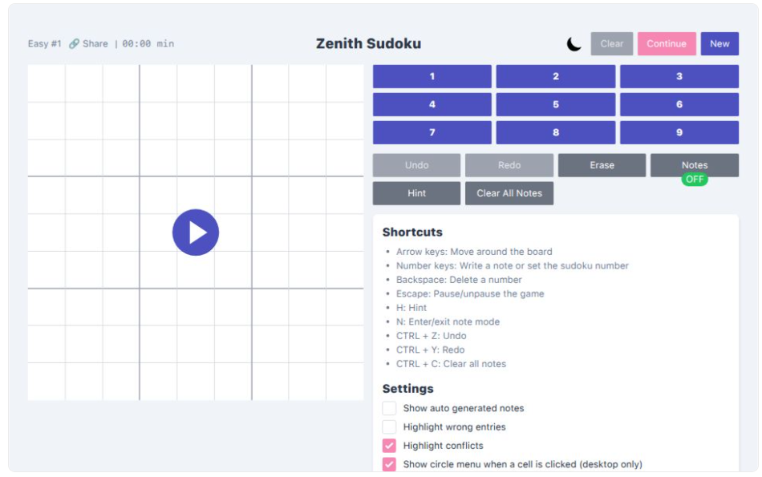

# Zenith Sudoku

A modern, open-source Sudoku game with a clean, user-friendly interface. Play thousands of puzzles across multiple difficulty levels, create your own custom puzzles, and track your progress.

🌐 **Live Demo**: [zenith-sudoku.vercel.app](https://zenith-sudoku.vercel.app)



---

## ✨ Features

- **Puzzles for Every Level**: Enjoy a vast collection of puzzles ranging from *Easy* to *Evil*.
- **Intuitive Interface**: A clean, distraction-free design that makes playing Sudoku a pleasure.
- **Smart Tools**:
  - Notes Mode (with auto-generation)
  - Hints
  - Conflict highlighting
  - Clear all notes option
- **Progress Saving**: Automatically saves your game state so you can continue where you left off.
- **Custom Puzzle Creator**: Design your own unique Sudoku puzzles with built-in solvability validation.
- **Keyboard Shortcuts**: Play efficiently with full desktop keyboard support.
- **PWA Ready**: Install on mobile devices and play offline.

---

## 🛠️ Development Setup

### ✅ Prerequisites
- Node.js (v20 or higher)
- npm or pnpm

### 🚀 Quick Start

```bash
# Clone the repository
git clone https://github.com/Codgramer/zenith-sudoku.git
cd zenith-sudoku

# Install dependencies
npm install
# or
pnpm install

# Start development server
npm run start
# or
pnpm run start
```

Then open your browser at [http://localhost:3000](http://localhost:3000)

---

## ⚙️ How to Play

### 🔢 Basic Gameplay

- **Select a puzzle**: Choose your difficulty from the menu.
- **Enter numbers**: Click a cell, then select a number from the pad.
- **Use Notes mode**: Click the “Notes” button or press `N` to add pencil marks.
- **Erase a cell**: Use the "Erase" button or press `Backspace`.
- **Undo/Redo**: Use buttons or shortcuts `Ctrl+Z` / `Ctrl+Y`.

### ⌨️ Keyboard Shortcuts

| Action             | Shortcut         |
|--------------------|------------------|
| Navigate           | Arrow Keys       |
| Enter Number       | `1` - `9` keys   |
| Toggle Notes Mode  | `N`              |
| Erase Cell         | `Backspace`      |
| Undo               | `Ctrl+Z` or `Cmd+Z` |
| Redo               | `Ctrl+Y` or `Cmd+Y` |
| Clear All Notes    | `Ctrl+C` or `Cmd+C` |

---

## 📦 Settings Panel

- Show auto-generated notes
- Highlight wrong entries
- Highlight conflicts
- Enable circle menu on cell click (desktop)

---

## 💡 About

This app is and always will be free to use.  
Built with ❤️ by **Himanshu**.  
Source code available on GitHub: [https://github.com/Codgramer/zenith-sudoku](https://github.com/Codgramer/zenith-sudoku)

> If you find a bug or want to request a feature, feel free to [open an issue](https://github.com/Codgramer/zenith-sudoku/issues).

---

## 📄 License

This project is open source under the [MIT License](./LICENSE).
